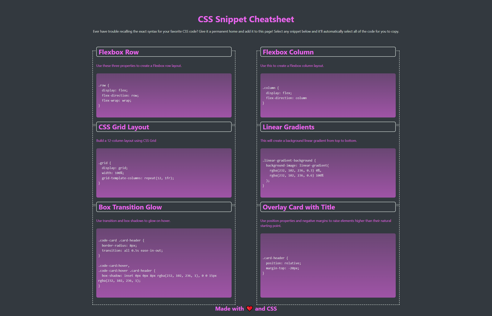

# CSS Snippet Cheatsheet

This is a simple web page that serves as a CSS Snippet Cheatsheet. It provides a collection of common CSS snippets along with their corresponding code examples. The page allows users to easily copy and use these snippets in their own projects.

## Usage

1. Open the `index.html` file in a web browser.
2. Browse through the available CSS snippets.
3. Click on a snippet to select and copy the corresponding code.
4. Paste the code into your own project and modify it as needed.

## Snippet Examples

The cheatsheet includes the following CSS snippets:

- Flexbox Row: Create a Flexbox row layout.
- Flexbox Column: Create a Flexbox column layout.
- CSS Grid Layout: Build a 12-column layout using CSS Grid.
- Linear Gradients: Create a background linear gradient.
- Box Transition Glow: Add transition and box shadows for a glow effect on hover.
- Overlay Card with Title: Use position properties and negative margins to raise elements higher.

Feel free to add your own CSS snippets to the cheatsheet by modifying the `index.html` file and adding new `code-card` elements.

## Contributing

Contributions to the CSS Snippet Cheatsheet are welcome! If you have additional CSS snippets or improvements to the existing code, please follow these steps:

1. Fork the repository.
2. Create a new branch for your changes.
3. Make the necessary modifications.
4. Submit a pull request with a clear description of your changes.

## License

This project is licensed under the [MIT License](LICENSE).
